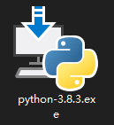
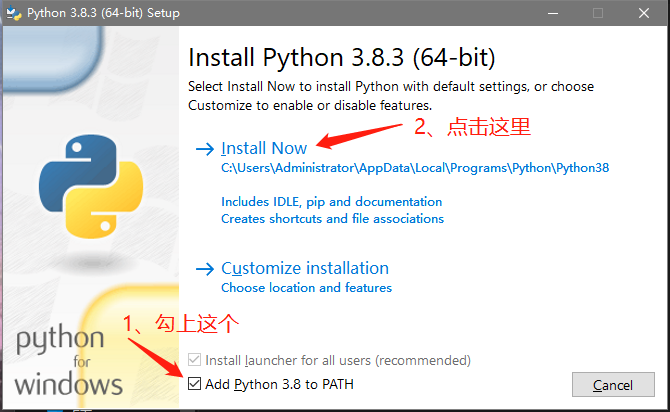
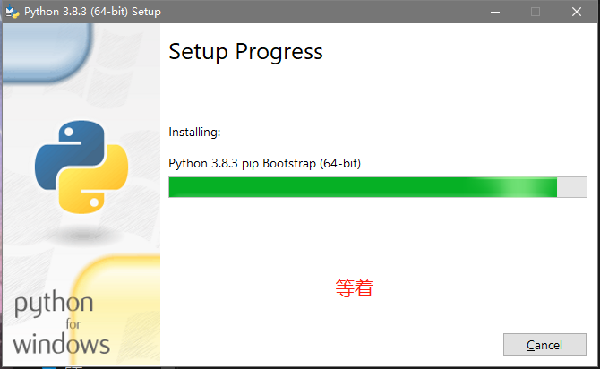
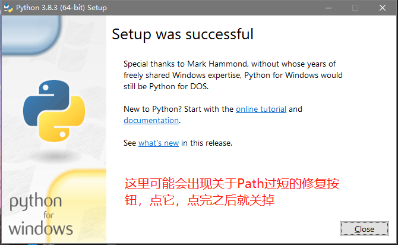
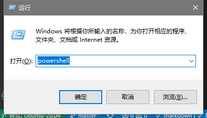
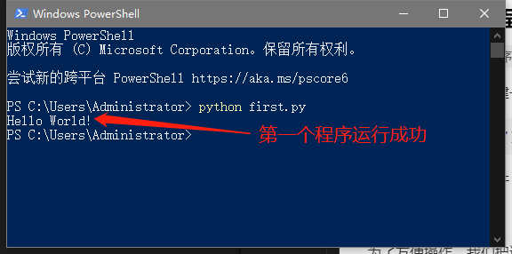

# 第000天

### 了解Python

> Python是一种编程语言，可以做很多事，比如帮你把很复杂的表格进行分析统计，也可以让你工作中重复操作的一些事情自动化。

### 安装Python

在Windows上安装Python很简单，只需要下载一个东西就行了，戳下面的链接：

[Python 3.8](https://www.python.org/ftp/python/3.8.3/python-3.8.3-amd64.exe)

下载后，运行下面这个东西：



常规操作，一直下一步，下一步：





环境安装完成了以后我们验证一下：

`win + r`打开运行，输入`powershell`回车：



在命令行输入`python --version`：


### 不管多牛批的程序猿都要从这个开始

> 创建我的第一个程序——Hello World!

在任何一个地方，创建一个文件，重命名为`first.py`，然后把下面的这段内容复制过去：

```python
print('Hello World!')
```

也可以直接用这个文件：

[first.py](./first.py)

为了方便操作，我们把这个文件拷贝到`C:\Users\Administrator`下面：

然后再次打开`powershell`，输入命令`python first.py`:



