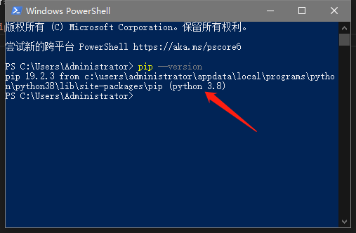
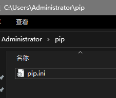
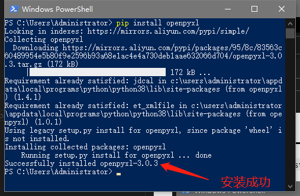

# 第001天 用Python操作Excel

### 安装必要的库

使用Python来操作excel将会用到一个库——`OpenPyXL`，将使用Python自带的库管理工具`pip`进行安装。

打开powershell，输入`pip --version`，可以看到该工具的信息



> Tips: 因为这些库都是外国人写的，放库的服务器都在外国，因为众所周知的原因，国内下载这些库会很慢，所以有人受不鸟了，就在国内做了一些这些库的镜像，这里需要配置一下。
> 在`C:\Users\Administrator`下面创建一个`pip`文件夹，在里面创建一个`pip.ini`文件，然后把下面这段内容复制进去，保存。

 ```
 [global]
 trusted-host=mirrors.aliyun.com
 index-url=https://mirrors.aliyun.com/pypi/simple/
 ```

 


### 开始安装OpenPyXL

打开powershell，输入`pip install openpyxl`，等一会可以看到该工具的安装完成的信息。



### 创建一个Excel文件

创建一个`makeExcel.py`，然后将下面的代码复制进去，然后在命令行里运行一下：

```python
from openpyxl import Workbook

# 创建一个工作簿
wb = Workbook()

# 创建一个工作表
ws = wb.create_sheet(0)

# 切换到我们创建的表
wb.active = 1

# 更改工作表的名称
ws.title = '我的工作表'

# 给表格填一些数据
ws['A1'] = '小明'
ws['A2'] = '小红'
ws['B1'] = 59
ws['B2'] = 98

# 做点计算
wx['A3'] = '他们相差'
ws['B3'] = abs(ws['B1'].value - ws['B2'].value)

# 保存这个工作簿
wb.save('./第一个工作簿.xlsx')
```

### 参考文章

[Python利用OpenPyXL来操作Excel（一）](https://zhuanlan.zhihu.com/p/51292549)